# Network Analysis: Summary of Operations

## Table of Contents
- Time Thieves
- Vulnerable Windows Machines
- Illegal Downloads

### Time Thieves

- At least two users on the network have been wasting time on YouTube. Usually, IT wouldn't pay much mind to this behavior, but it seems these people have created their own web server on the corporate network. So far, Security knows the following about these time thieves:
    - They have set up an Active Directory network.
    - They are constantly watching videos on YouTube.
    - Their IP addresses are somewhere in the range 10.6.12.0/24.

- **What is the domain name of the users' custom site?**
    - `ip.addr==10.6.12.0/24 and dns.resp.name`
    - 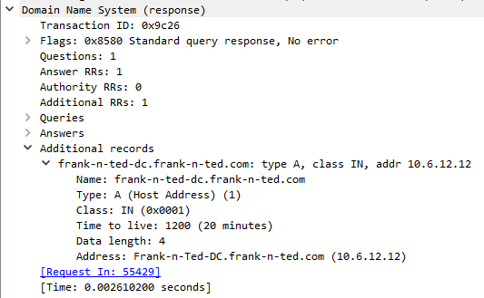
    - The domain name is `Frank-n-Ted-DC.frank-n-ted.com`

- **What is the IP address of the Domain Controller (DC) of the AD network?**
    - `ip.addr==10.6.12.0/24`
    - 
    - The IP of the DC is `10.6.12.12`

- **What is the name of the malware downloaded to the 10.6.12.203 machine? Once you have found the file, export it to your Kali machine's desktop.**
    - `ip.addr==10.6.12.203 and http.request.method==GET`
    - 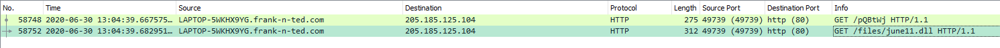
    - The name of the malware is `june11.dll`
    - To download it we will go to File > Export Objects > HTTP 
    - Than type `june` into the filter
    - 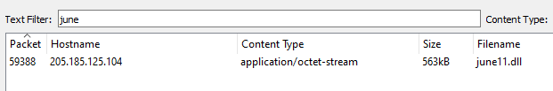
    - We than selecte the it and press save than direct it to the desktop

- **Upload the file to VirusTotal.com. What kind of malware is this classified as?**
    - We visit virustotal.com and upload the file
    - 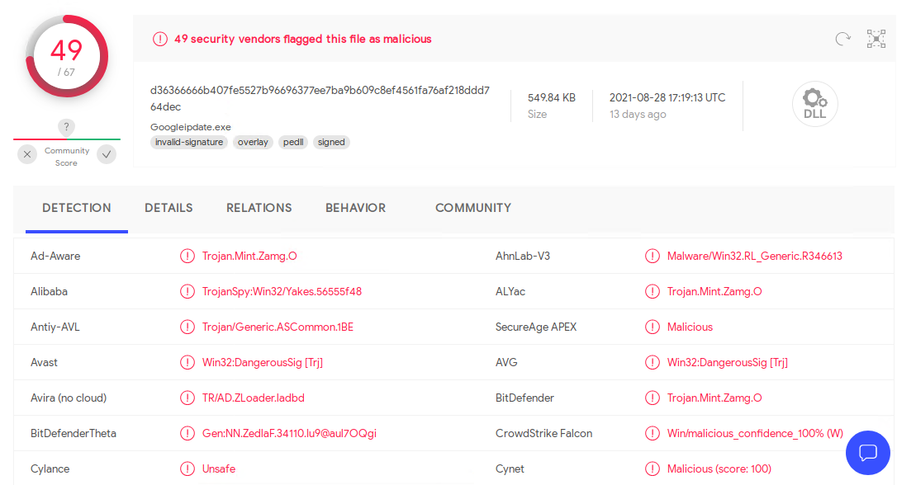
    - We can see that the file is a `Trojan` malware

### Vulnerable Windows Machines

- The Security team received reports of an infected Windows host on the network. They know the following:
    - Machines in the network live in the range 172.16.4.0/24.
    - The domain mind-hammer.net is associated with the infected computer.
    - The DC for this network lives at 172.16.4.4 and is named Mind-Hammer-DC.
    - The network has standard gateway and broadcast addresses.

- **Find the following information about the infected Windows machine:**
    - **Host name**: rotterdam-pc
        - `ip.addr==172.16.4.4 and kerberos.CNameString`
        - 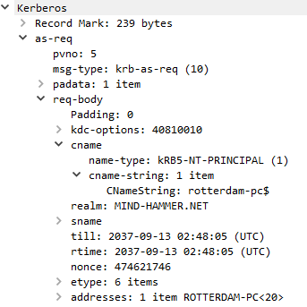
    - **IP Address**: 172.16.4.205
        - `ip.addr==172.16.4.4 and kerberos.CNameString`
        - 
    - **MAC Address**: a4:ba:db:19:49:50
        - `ip.addr==172.16.4.4 and kerberos.CNameString`
        - 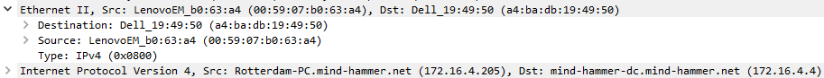

- **What is the username of the Windows user whose computer is infected?**
    - `ip.addr==172.16.4.205 and kerberos.CNameString and !(kerberos.CNameString contains $)`
    - 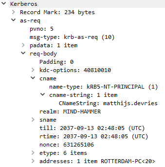
    - The infected pc's username is `matthijs.devries`

- **What are the IP addresses used in the actual infection traffic?**
    - `ip.addr==172.16.4.205`
    - We will check the flow of packet traffic to see what other computers are involved
    - Statistics > Conversations
    - Now select the IPV4 heading at the top and select the `Limit to display filter` at the bottom than sort by Packets
    - 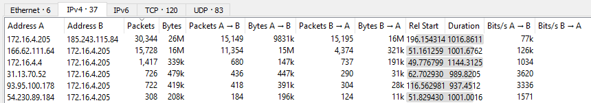
    - We can see that both `185.243.115.84` and `166.62.111.64` both have suspicouse amounts of traffic flowing to or from the infected pc

- **As a bonus, retrieve the desktop background of the Windows host.**
    - `ip.addr==172.16.4.205 and png.ihdr.width == 1920`
    - 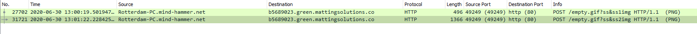
    - We can see that there are 2 packets containing a desktop sized image so we go to File > Export Objects > HTTP
    - We type `empty.gif?` into the search filter and we download the first file
    - After renaming the file to a png we see that we have found the desktop image
    - 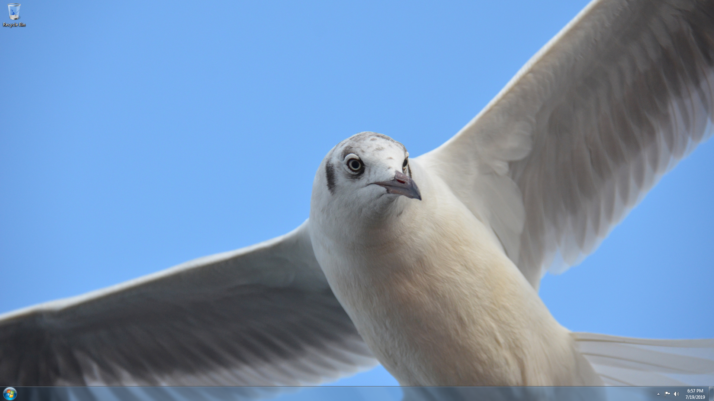

### Illegal Downloads

- IT was informed that some users are torrenting on the network. The Security team does not forbid the use of torrents for legitimate purposes, such as downloading operating systems. However, they have a strict policy against copyright infringement.
- IT shared the following about the torrent activity:
    - The machines using torrents live in the range 10.0.0.0/24 and are clients of an AD domain.
    - The DC of this domain lives at 10.0.0.2 and is named DogOfTheYear-DC.
    - The DC is associated with the domain dogoftheyear.net.

- **Find the following information about the machine with IP address 10.0.0.201:**
    - **MAC Address**: 00:16:17:18:66:c8
        - `ip.addr==10.0.0.201`
        - 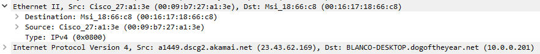
    - **Windows Username**: elmer.blanco
        - `ip.addr==10.0.0.201 and kerberos.CNameString and !(kerberos.CNameString contains $)`
        - 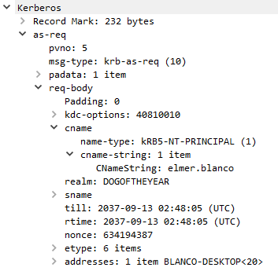
    - **OS Version**: Windows 10
        - `ip.addr==10.0.0.201 and http.request.method==GET`
        - We take some form of HTTP traffic and we will check it for the User Agent
        - Right click one of the packets and select Follow > TCP Stream
        - 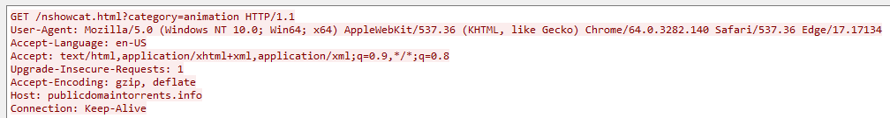
        - We know that Windows NT 10.0 is Windows 10

- **Which torrent file did the user download?**
    - We first go to File > Export Objects > HTTP
    - We type `.torrent` into the search filter
    - 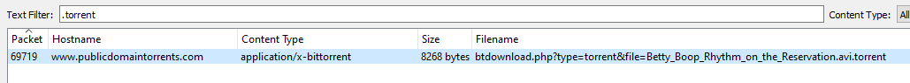
    - We can now easily see that they downloaded `Betty_Boop_Rhythm_on_the_reservation.avi.torrent`