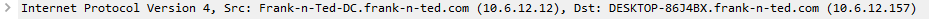

# Network Analysis: Summary of Operations

## Table of Contents
- Time Thieves
- Vulnerable Windows Machines
- Illegal Downloads

### Time Thieves

At least two users on the network have been wasting time on YouTube. Usually, IT wouldn't pay much mind to this behavior, but it seems these people have created their own web server on the corporate network. So far, Security knows the following about these time thieves:
- They have set up an Active Directory network.
- They are constantly watching videos on YouTube.
- Their IP addresses are somewhere in the range 10.6.12.0/24.

What is the domain name of the users' custom site?
- `ip.addr==10.6.12.0/24 and dns.afsdb.hostname`
- 
- The domain name is `Frank-n-Ted-DC.frank-n-ted.com`

What is the IP address of the Domain Controller (DC) of the AD network?
- `ip.addr==10.6.12.0/24`
- 
- The IP of the DC is `10.6.12.12`

What is the name of the malware downloaded to the 10.6.12.203 machine? Once you have found the file, export it to your Kali machine's desktop.
- `ip.addr==10.6.12.203 and http.request.method==GET`
- 
- The name of the malware is `june11.dll`
- To download it we will go to File > Export Objects > HTTP and type june into the filter
- 
- We than selecte the it and press save than direct it to the desktop

Upload the file to VirusTotal.com. What kind of malware is this classified as?
- We visit virustotal.com and upload the file
- 
- We can see that the file is a `Trojan` malware
